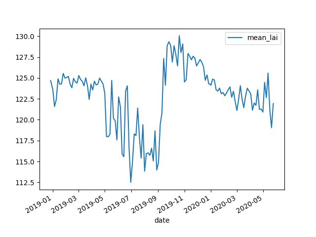
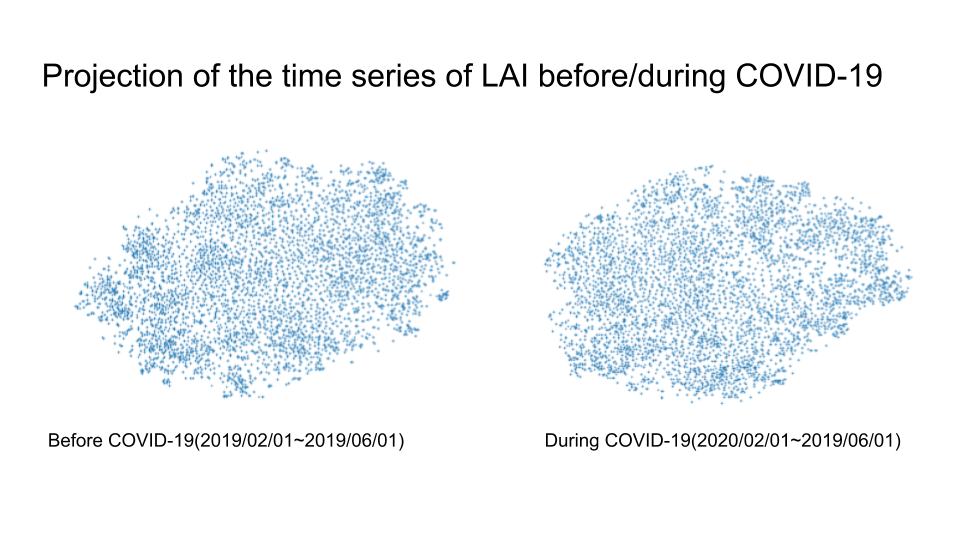

# Covid-19 SpaceAppsChallenge

## Summary

Covid-19 has been damaging the whole world, however, people in developing countries are at higher risk of depression due to pandemic caused by public health and economic impact. In this project, we utilize satellite information to tackle deforestation in regards to Slash-and-burn agriculture in ASEAN countries where its economy relies on the method. Besides, our team suggests the use of a data analysis which enables us to visualize the effects of Covid-19 along with UN Sustainable Development

## How We Addressed This Challenge

Systems which support citizens to maintain a decent standard of living during crises such as the COVID-19 pandemic are absent or underdeveloped throughout many ASEAN countries. As such people living in those countries without support systems   face significant challenges including a loss of income and reduction in ability to support the welfare of their families. Our team aims to engage ASEAN countries by conducting investigations into the impact by COVID-19 on a country's unique societal dynamics and challenges within SDG11: Sustainable Cities and Communities framework. We provide an example wherein during March, Laos usually prepare to undertake Slash-and-burn agricultural activities. As such we analyzed the effects from Covid-19 on these activities in ASEAN countries.

## How We Developed This Project

Every community has its own unique societal structure, economical dependencies and ecosystems. This principle includes the application of traditional Slash-and-burn agricultural methods which are/were widely applied in ASEAN countries. The agricultural, farming and resource acquisition methods employed by a region affect the lives of those community members living within close proximity. Aware that a pandemic such as that experienced with COVID-19 may destroy the beautiful harmony of nature as humans lack resources and prioritize urgent need of maintaining the economy, our team was cautious in our approach investigating the Indochinese Peninsula images taken by the MODIS satellite from NASA. Our team used image processing and machine learning methods with python to treat and compare data from January 2019 to May 2020. As a result we gained insight which suggests Slash-and-burn agriculture started earlier in 2020 than that of 2019. From these data we suggest COVID-19 may have impacted the economy in ASEAN countries by influencing the early commencement of slash-and-burn agriculture altering, and potentially causing damage to, pre-established anthropogenic and natural burn-growth cycles.

## Project Demo

From this video, we were able to obtain information on the time scale of the vegetation variation. Since it was found that vegetation changes were very widespread, it was averaged over the whole area. The changes were shown in a graph. The results show that the forest area in this area is slightly less than the same period last year, and that it has been declining since earlier in the year.

[video link](https://drive.google.com/open?id=1GPR3YeYB1yuMvK3K43Gc82oTCOdFkcsO)



Next, in order to observe the changes in higher resolution and longer time span, a 5 km square data point was extracted and projected into two-dimensional space using t-SNE. It gives us the visual information to detect outliers at a glance. It is likely that the points corresponding to outliers in the projected two-dimensional space have a different way of changing vegetation than other points.



If the location of that point is close to a human settlement, it may be under the influence of COVID-19, so you'll need to direct your attention to that area. When this visualization method is applied to data over a longer time span, it is expected that it can be used to detect anomalous movements in the data and predict infectious diseases.

---

## setup

### install dependencies

```bash
poetry install
```
